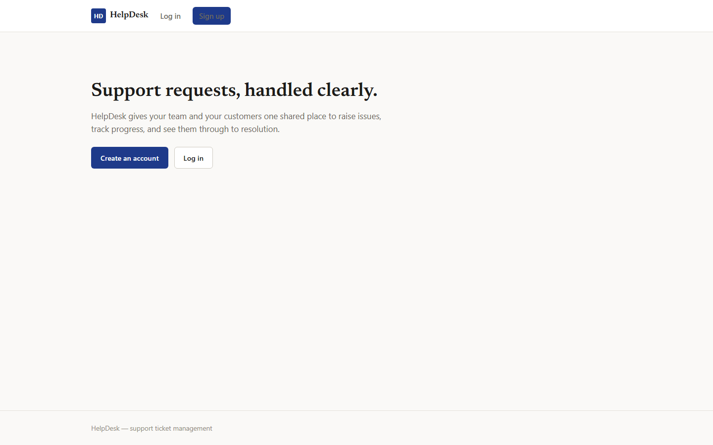
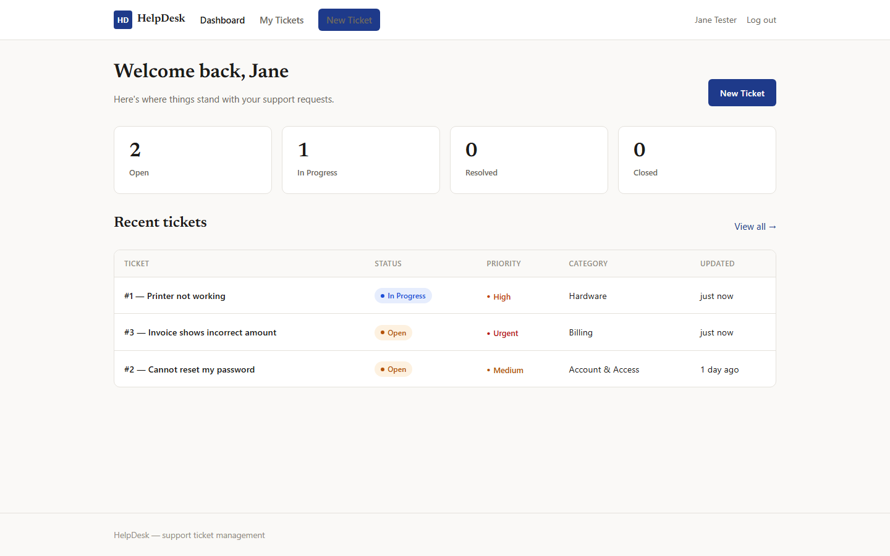
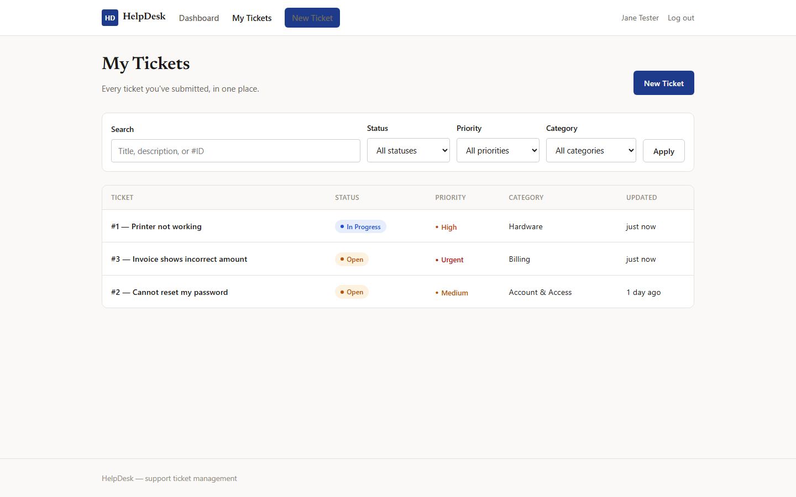
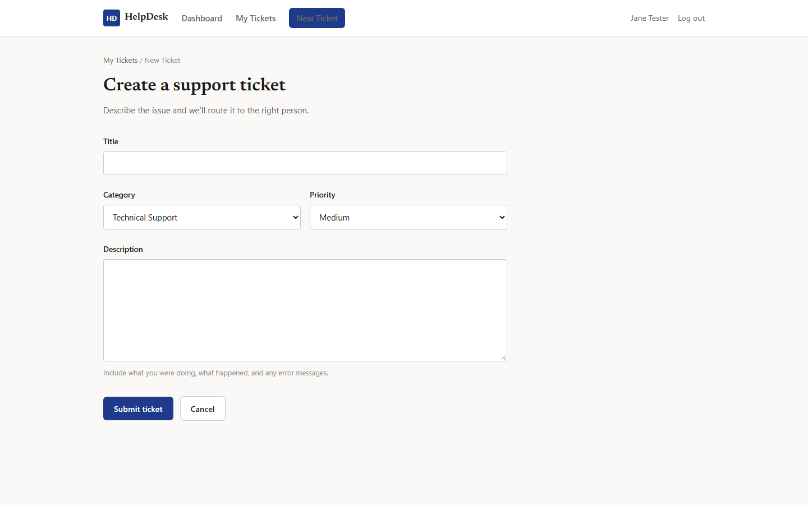
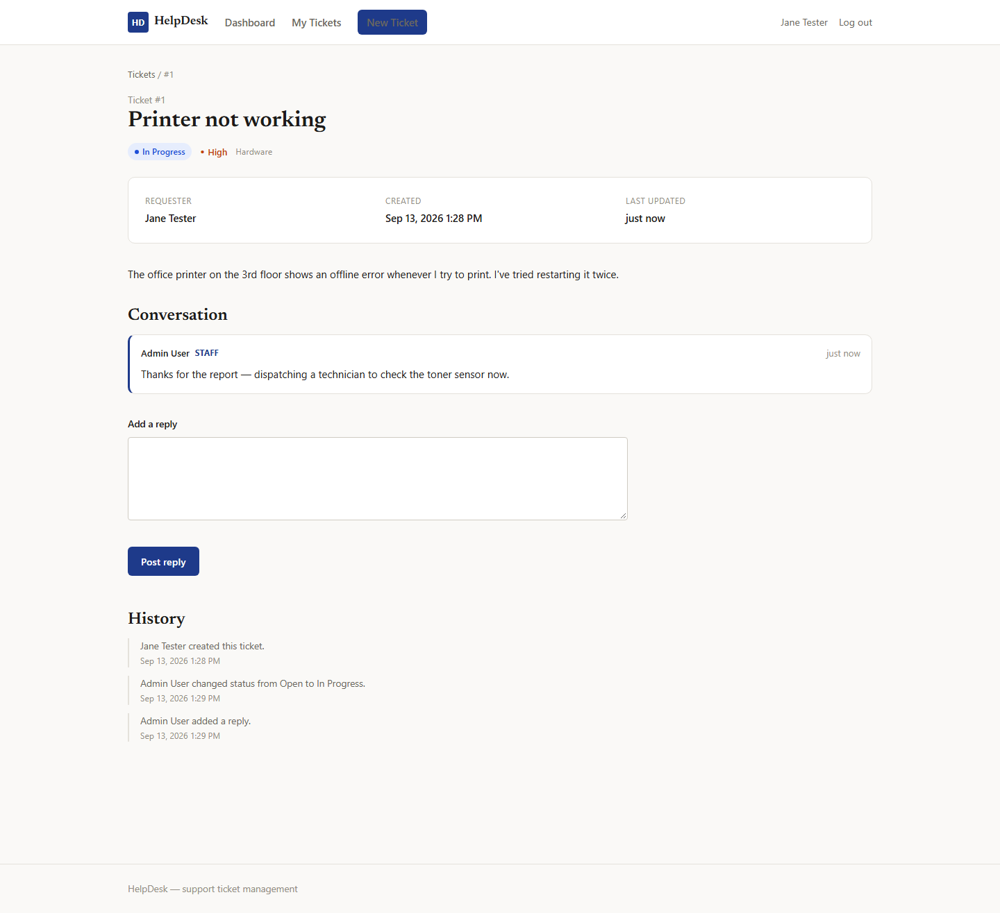
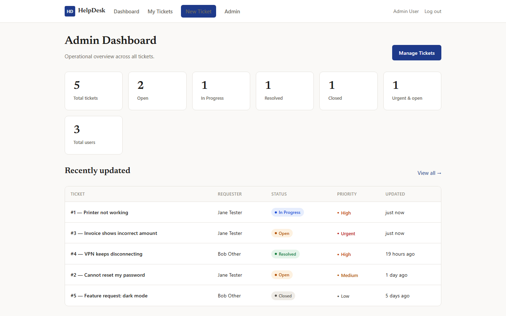
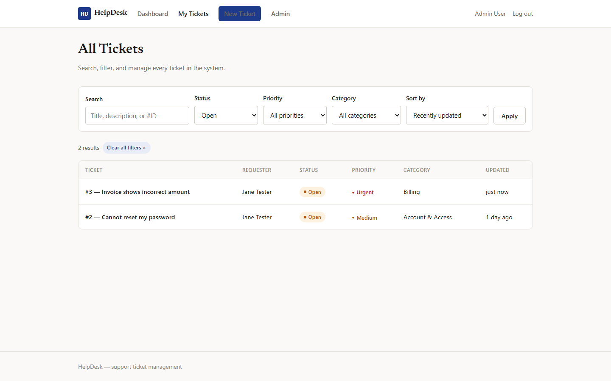
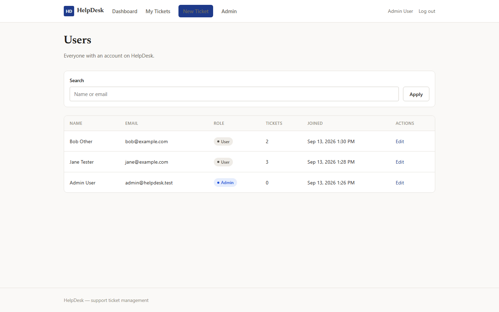
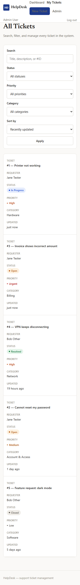

# HelpDesk

A browser-based support ticket management system. Users register, submit tickets, and track them through resolution; staff/admin users triage, respond to, and manage tickets and accounts. Built in plain PHP against MySQL to demonstrate server-side fundamentals without a framework.

## Features

- Registration, login, logout with hashed passwords and session-based authentication
- Role-based authorization (user / admin) enforced server-side on every protected page and action
- Ticket CRUD: create, view, edit, and delete, scoped to the owner (or any ticket for admins)
- Ticket lifecycle with enforced status transitions (`open → in_progress → resolved → closed`, with user-initiated reopening from `resolved`)
- Priority (low/medium/high/urgent) and category classification
- Threaded comments/replies on tickets, with staff replies visually distinguished
- Full ticket history/audit trail (status, priority, category changes; comments; edits)
- Admin dashboard with real, database-derived statistics
- Admin ticket management: search, filter (status/priority/category), sort, paginate
- Admin user management: edit user details/role, delete users (blocked while they have tickets on file)
- Search (GET-based) and combinable filters, preserved across pagination
- Full server-side validation on every form, with inline field-level error messages
- CSRF protection on every state-changing request
- IDOR protection: ticket/comment access is scoped to the owner at the query level, not checked after the fact
- Responsive layout, including a stacked-card fallback for tables on small screens
- Empty, no-results, and error states throughout — no page is ever left blank

## Tech Stack

- PHP 8.4
- MySQL 8 (via PDO)
- HTML, CSS, vanilla JavaScript
- No framework, no build step

## Architecture

Plain PHP files map directly to URLs (`tickets.php`, `ticket-view.php`, etc.); there is no router. State-changing requests are handled by dedicated scripts under `actions/`, which validate input, enforce authorization, write to the database, and redirect back to a page (POST/redirect/GET) so a page refresh never resubmits a form.

```
helpdesk/
├── index.php, login.php, register.php, logout.php
├── dashboard.php, tickets.php, ticket-create.php, ticket-view.php, ticket-edit.php
├── admin/            admin dashboard, ticket management, user management
├── actions/          POST handlers for every state-changing operation
├── config/           environment loading, shared option lists, PDO connection
├── includes/         auth, CSRF, flash messages, ticket helpers, layout partials
├── assets/           CSS and JS
├── database/          schema.sql
```

`includes/bootstrap.php` is required by every entry point first — it loads config, opens the session (under a project-specific session name to avoid colliding with other local projects), and pulls in the shared helper files, so no page has to remember the require order.

## Database

Four tables:

- **users** — id, name, email (unique), hashed password, role (`user`/`admin`)
- **tickets** — id, owner (`user_id`), title, description, category, priority, status, timestamps
- **comments** — id, ticket_id, user_id, message, timestamp
- **ticket_history** — id, ticket_id, user_id (nullable), action, old_value, new_value, timestamp — an audit trail written on every mutating action so the ticket detail page can show a real history, not just a "last updated" date

`tickets.user_id` is `ON DELETE RESTRICT` (a user with tickets can't be deleted, preserving support history); `comments` and `ticket_history` cascade with their ticket; `ticket_history.user_id` is `ON DELETE SET NULL` so an audit entry survives even if the acting user's account is later removed.

## Authentication & Security

- Passwords hashed with `password_hash()` / verified with `password_verify()` — plaintext is never stored
- All database access goes through PDO prepared statements with bound parameters — no query ever concatenates user input
- Output is escaped with `htmlspecialchars()` everywhere user-generated content is rendered
- Every state-changing form carries a CSRF token, validated before the request is processed
- Session ID is regenerated on login/registration (`session_regenerate_id(true)`) to prevent session fixation
- Authorization (ownership + role) is checked server-side on every read and write — a ticket ID guessed or edited in the URL by another user returns a 404, not the other user's data
- Status/priority/category transitions are validated against a fixed set of rules server-side; the browser's controls are a convenience, not the authority
- Production mode hides internal error detail from the browser and logs it instead

## Setup

1. Clone the repository.
2. Create a MySQL database named `helpdesk` (or update `.env` to match your own name).
3. Import the schema:
   ```
   mysql -u root -p helpdesk < database/schema.sql
   ```
4. Copy `.env.example` to `.env` and fill in your database credentials.
5. Start the PHP built-in server from the project root:
   ```
   php -S localhost:8000
   ```
6. Visit `http://localhost:8000` and register an account. To test admin features, promote a user's `role` to `admin` directly in the database.

## Test Credentials

The screenshots above and the local demo database include these seeded accounts for trying out both roles without registering:

| Role  | Email                 | Password     |
|-------|-----------------------|--------------|
| Admin | admin@helpdesk.test   | Admin1234    |
| User  | jane@example.com      | password123  |

These exist only in local development data — they are not present in a fresh clone importing `database/schema.sql`, and no such accounts exist on any deployed instance.

## Screenshots

**Landing page**


**User dashboard**


**My Tickets — search, filter, and pagination**


**Creating a ticket**


**Ticket detail — metadata, conversation, and history**


**Admin dashboard — real, database-derived statistics**


**Admin ticket management**


**Admin user management**


**Responsive layout on mobile**


## Live Demo

Not yet deployed.
